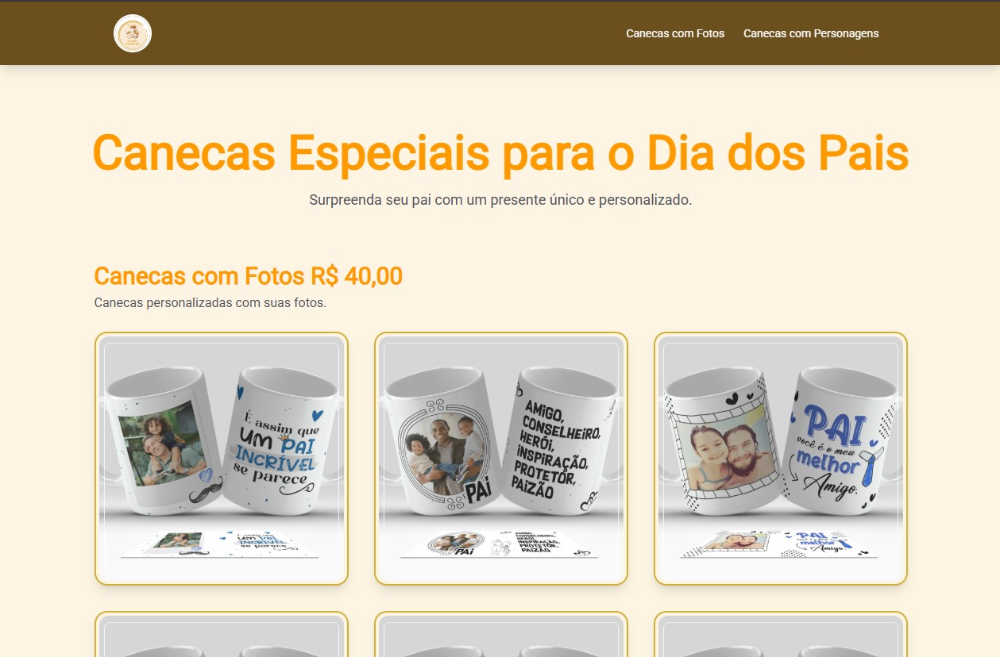

🔗 Acesse o Projeto Online: [michelepresentes.vercel.app](https://michelepresentes.vercel.app/)

# 🎁 Michele Presentes

**Michele Presentes** é um catálogo online interativo para uma loja de presentes personalizados, com foco em canecas. O site foi desenvolvido para oferecer uma experiência de compra prática, com um visual moderno e intuitivo. Os clientes podem visualizar os produtos, adicioná-los ao carrinho e finalizar o pedido de forma rápida e fácil através do WhatsApp.

## 🚀 Tecnologias

Este projeto foi desenvolvido utilizando:

- **React** – Biblioteca para construção da interface
- **TypeScript** – Tipagem estática para maior segurança e escalabilidade
- **TailwindCSS** – Estilização rápida e responsiva com utilitários CSS

## 🎯 Funcionalidades

- 📋 **Catálogo de produtos** com uma variedade de canecas personalizadas para o Dia dos Pais
- ➕ **Adição de itens ao carrinho** para facilitar a seleção de produtos
- 🛒 **Resumo do pedido** com os itens selecionados
- 💬 **Finalização do pedido via WhatsApp**, com envio automático da descrição dos itens
- 📱 **Design responsivo**, adaptado para dispositivos móveis
